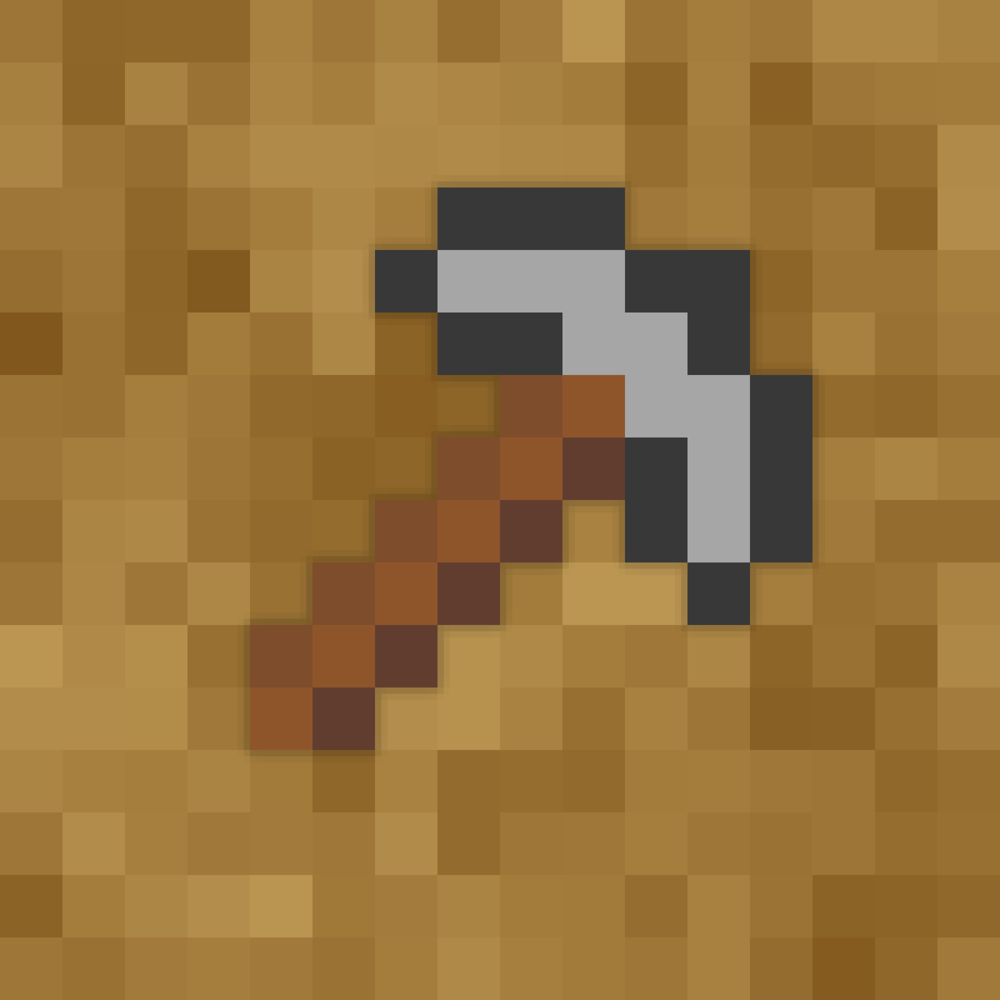

[license]: LICENSE
[license-shield]: https://img.shields.io/badge/License-MIT-yellow.svg
[release]: https://github.com/BurrowStudios/Obelisk/releases
[release-shield]: https://img.shields.io/github/release/BurrowStudios/Obelisk.svg

[build-shield-api]: https://img.shields.io/github/actions/workflow/status/BurrowStudios/Obelisk/build-api.yaml?label=API
[build-shield-app]: https://img.shields.io/github/actions/workflow/status/BurrowStudios/Obelisk/build-app.yaml?label=Application
[build-shield-util]: https://img.shields.io/github/actions/workflow/status/BurrowStudios/Obelisk/build-util.yaml?label=Utils

<!--suppress CheckImageSize, HtmlRequiredAltAttribute -->

[![license-shield][]][license]
[![release-shield][]][release]

#### Build status

![build-shield-api]
![build-shield-app]
![build-shield-util]

# Obelisk

Obelisk is the Burrow Studios Support System.

### ⚠️ Early development notice ⚠️

Please note that this application is still in early development.
