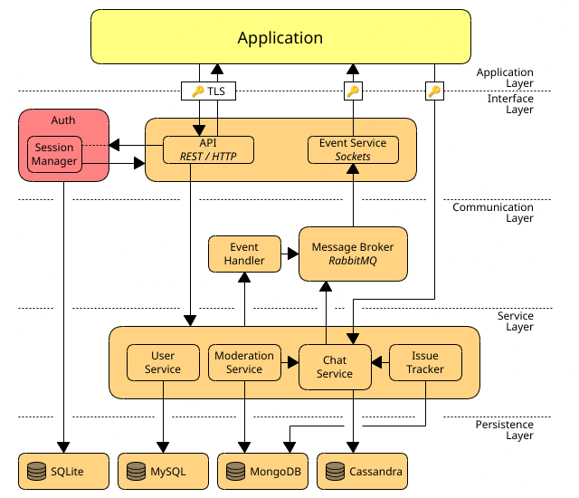

[license]: LICENSE
[license-shield]: https://img.shields.io/badge/License-MIT-yellow.svg
[release]: https://github.com/BurrowStudios/Obelisk/releases
[release-shield]: https://img.shields.io/github/release/BurrowStudios/Obelisk.svg

[![license-shield][]][license]
[![release-shield][]][release]

# Obelisk

Obelisk is the Burrow Studios API. This repository servers as a monorepo for all projects that form the backend and any
API clients.

### Projects

[build-common]: https://github.com/BurrowStudios/Obelisk/actions/workflows/build-common.yaml
[build-common-shield]: https://img.shields.io/github/actions/workflow/status/BurrowStudios/Obelisk/build-common.yaml
[build-shelly]: https://github.com/BurrowStudios/Obelisk/actions/workflows/build-shelly.yaml
[build-shelly-shield]: https://img.shields.io/github/actions/workflow/status/BurrowStudios/Obelisk/build-shelly.yaml
[build-api]: https://github.com/BurrowStudios/Obelisk/actions/workflows/build-api.yaml
[build-api-shield]: https://img.shields.io/github/actions/workflow/status/BurrowStudios/Obelisk/build-api.yaml
[build-server]: https://github.com/BurrowStudios/Obelisk/actions/workflows/build-server.yaml
[build-server-shield]: https://img.shields.io/github/actions/workflow/status/BurrowStudios/Obelisk/build-server.yaml

| Project         | Layer                                          | Relative Path                       | Status                                   | Description                                                                         |
|-----------------|------------------------------------------------|-------------------------------------|------------------------------------------|-------------------------------------------------------------------------------------|
| Commons Library |                                                | [`obelisk-common/`](obelisk-common) | [![build-common-shield][]][build-common] | Some utilities commonly used in multiple Obelisk services and components            |
| Message Broker  | Communication                                  | [`message-broker/`](message-broker) | Incomplete                               | Template setup for the [RabbitMQ](https://www.rabbitmq.com/) backend message broker |
| Shelly          | Interface                                      | [`Shelly/`](Shelly)                 | [![build-shelly-shield][]][build-shelly] | Authentication & Authorization service                                              |
| API client      | Application                                    | [`obelisk-api/`](obelisk-api)       | [![build-api-shield][]][build-api]       | Burrow Studios API client library                                                   |
| Server          | Interface, Communication, Service& Persistence | [`obelisk-server/`](obelisk-server) | [![build-server-shield][]][build-server] | Monolithic backend server (legacy)                                                  |

### Architecture

The repository is currently still in the process of migrating into a monorepo (splitting up modules into separate
projects) and thus, the architecture is still a bit fuzzy. This is the current plan for a less monolithic architecture:

### ⚠️ Early development notice ⚠️

Please note that this application is still in early development and not officially supported until the first release.
